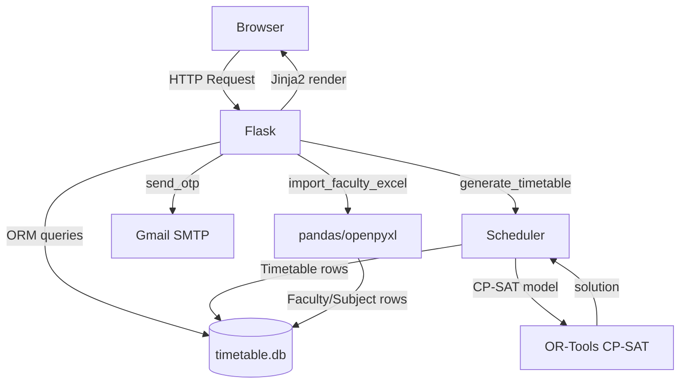

# PROJECT DOCUMENTATION — ATSS
## Automatic Timetable Scheduling System

> **Single source of truth** for developers and AI coding agents.
> Read this file before modifying any part of the project.

---

## Table of Contents

1. [Project Overview](#1-project-overview)
2. [Project Structure](#2-project-structure)
3. [Technology Stack](#3-technology-stack)
4. [Application Architecture](#4-application-architecture)
5. [Complete Application Workflow](#5-complete-application-workflow)
6. [User Roles and Permissions](#6-user-roles-and-permissions)
7. [Features and Functions](#7-features-and-functions)
8. [Functions and Methods](#8-functions-and-methods)
9. [Business Logic](#9-business-logic)
10. [Validation Rules](#10-validation-rules)
11. [Authentication and Authorization](#11-authentication-and-authorization)
12. [Database](#12-database)
13. [API Documentation](#13-api-documentation)
14. [Frontend Workflow](#14-frontend-workflow)
15. [Backend Workflow](#15-backend-workflow)
16. [Error Handling](#16-error-handling)
17. [Security](#17-security)
18. [Configuration and Environment Variables](#18-configuration-and-environment-variables)
19. [Dependencies](#19-dependencies)
20. [Setup and Installation](#20-setup-and-installation)
21. [Important Workflows](#21-important-workflows)
22. [State and Data Flow](#22-state-and-data-flow)
23. [Important Algorithms and Logic](#23-important-algorithms-and-logic)
24. [Edge Cases](#24-edge-cases)
25. [Known Issues and TODOs](#25-known-issues-and-todos)
26. [Testing](#26-testing)
27. [Deployment](#27-deployment)
28. [Rules for Future AI Coding Agents](#28-rules-for-future-ai-coding-agents)
29. [Change Log](#29-change-log)

---

## 1. Project Overview

**Project Name:** ATSS — Automatic Timetable Scheduling System

**Purpose:** Automates the generation of academic timetables for a college/university. Eliminates manual scheduling conflicts by using a constraint-satisfaction solver (Google OR-Tools CP-SAT) to assign faculty, subjects, divisions, time slots, and rooms without clashes.

**Problem it solves:**
- Manual timetable creation is error-prone and time-consuming
- Faculty clash (same teacher in two places at once)
- Division clash (same student group in two classes at once)
- Room double-booking
- Exceeding faculty weekly hour limits

**Target Users:** College administrators / timetable coordinators (single admin role currently active)

**Main Features:**
- Admin login with OTP-verified registration
- Faculty management (manual add + bulk Excel import)
- Subject management
- Room/lab management (auto-seeded on startup)
- CP-SAT constraint solver generates clash-free timetables
- Session-based generation: Odd semester (1,3,5,7) or Even semester (2,4,6)
- Timetable locking (lock individual entries to preserve them across regeneration)
- Export timetable to Excel (.xlsx) and PDF
- Client-side filtering (8 filter dimensions) and pagination (15 rows/page)
- Dark/light theme toggle persisted in localStorage
- Custom cursor animation (water-drop effect)
- Gmail OTP for registration and password reset

**Technology Stack:** Python/Flask backend, SQLite database, Jinja2 templates, Tailwind CSS (CDN), Google OR-Tools CP-SAT solver

**Current Status:** Development / local deployment. No production deployment configured.

---

## 2. Project Structure

```
atss_python/
├── app.py                  # App factory — creates Flask app, registers blueprints
├── config.py               # Config class + time slot/day/enum constants
├── extensions.py           # Shared extension instances (db, login_manager, bcrypt, csrf)
├── models.py               # SQLAlchemy ORM models (6 tables)
├── routes.py               # All route handlers in 6 blueprints
├── database.py             # DB initializer + room seeder
├── scheduler.py            # CP-SAT timetable generation engine
├── constraints.py          # CP-SAT hard constraint definitions
├── importer.py             # Excel → DB importer for faculty/subject/division/allocation
├── otp.py                  # Gmail SMTP OTP sender
├── .env                    # Gmail credentials (NOT committed to version control ideally)
│
├── instance/
│   └── timetable.db        # Active SQLite database
│
├── data/
│   ├── Faculty_Teaching_Allocation_Schedule_2.xlsx   # Sample import file
│   └── Faculty_ID.xlsx                               # Sample import file
│
├── static/
│   ├── style.css           # CSS variables, auth page styles, cursor animation
│   ├── cursor.js           # Water-drop cursor effect
│   ├── css/app.css         # Layout, sidebar, tables, cards (authenticated pages)
│   └── js/app.js           # Lock toggle JS, legacy theme toggle
│
├── templates/
│   ├── base.html           # Master layout with sidebar nav (authenticated pages)
│   ├── home.html           # Landing page (standalone, no base.html)
│   ├── login.html          # Login form (extends base.html)
│   ├── register.html       # Registration form (extends base.html)
│   ├── verify_otp.html     # OTP verification (extends base.html)
│   ├── forgot_password.html# Forgot password (standalone)
│   ├── reset_password.html # Reset password (standalone)
│   ├── setup_gmail.html    # Gmail SMTP config (standalone)
│   ├── dashboard.html      # Stats dashboard (extends base.html)
│   ├── faculty.html        # Faculty list + add + import (extends base.html)
│   ├── subjects.html       # Subject list + add (extends base.html)
│   ├── classroom.html      # Room list + add (extends base.html)
│   └── timetable.html      # Timetable view + filters + pagination (extends base.html)
│
├── security.py             # OBSOLETE — stub file only ("Replaced by app.py login route")
├── user.py                 # OBSOLETE — stub file only ("Replaced by models.py")
├── text.py                 # OBSOLETE — stub file only
├── DOCUMENTATION.md        # Earlier documentation (superseded by this file)
└── Faculty_Teaching_Allocation_Schedule.xlsx  # Root-level sample Excel
```

**Key dependency map:**
```
app.py
  └── extensions.py  (db, login_manager, bcrypt, csrf)
  └── models.py      (User, Faculty, Subject, Division, Room, Allocation, Timetable)
  └── routes.py      (auth, main, faculty_bp, subject_bp, room_bp, tt_bp)
  └── database.py    (init_db → db.create_all + _seed_rooms)
  └── config.py      (Config class, slot/day constants)

routes.py
  └── importer.py    (import_faculty_excel)
  └── scheduler.py   (generate_timetable)
  └── otp.py         (generate_otp, send_otp, is_configured)

scheduler.py
  └── constraints.py (add_hard_constraints, weekly_hours_limit, lab_batch_count)
  └── config.py      (DAYS, MORNING_SLOTS, GENERAL_SLOTS)
```

---

## 3. Technology Stack

| Technology | Purpose | Version | Where Used |
|---|---|---|---|
| Python | Backend language | 3.10 | All .py files |
| Flask | Web framework | 3.1.3 | app.py, routes.py |
| Flask-SQLAlchemy | ORM / DB layer | 3.1.1 | models.py, all routes |
| SQLite | Database | built-in | instance/timetable.db |
| Flask-Login | Session auth | 0.6.3 | extensions.py, routes.py |
| Flask-Bcrypt | Password hashing | 1.0.1 | extensions.py, routes.py |
| Flask-WTF / CSRFProtect | CSRF protection | 1.3.0 | extensions.py, all forms |
| SQLAlchemy | ORM core | 2.0.52 | models.py |
| Google OR-Tools (CP-SAT) | Constraint solver | latest | scheduler.py, constraints.py |
| pandas | Excel reading | latest | importer.py |
| openpyxl | Excel writing (export) | latest | routes.py export_excel |
| reportlab | PDF generation | latest | routes.py export_pdf |
| python-dotenv | .env loading | latest | config.py, otp.py |
| smtplib | Gmail SMTP | built-in | otp.py |
| Tailwind CSS | UI styling | CDN (latest) | All templates |
| Jinja2 | HTML templating | bundled with Flask | All templates |
| JavaScript (vanilla) | Client-side filtering, pagination, lock toggle | ES6 | timetable.html, app.js, cursor.js |

---

## 4. Application Architecture

**Pattern:** Monolithic Flask app using the App Factory pattern with Blueprints.

```
Browser
  │
  ▼
Flask App (app.py — create_app())
  │
  ├── Extensions (extensions.py)
  │     ├── SQLAlchemy (db)
  │     ├── LoginManager
  │     ├── Bcrypt
  │     └── CSRFProtect
  │
  ├── Blueprints (routes.py)
  │     ├── auth      → /login, /register, /verify-otp, /logout
  │     ├── main      → /, /dashboard
  │     ├── faculty_bp → /faculty, /faculty/add, /faculty/delete, /faculty/import
  │     ├── subject_bp → /subjects, /subjects/add, /subjects/delete
  │     ├── room_bp   → /rooms, /rooms/add, /rooms/delete
  │     └── tt_bp     → /timetable, /timetable/generate, /timetable/lock,
  │                      /timetable/export/excel, /timetable/export/pdf
  │
  ├── Models (models.py)
  │     └── User, Faculty, Subject, Division, Room, Allocation, Timetable
  │
  ├── Scheduler (scheduler.py + constraints.py)
  │     └── CP-SAT solver → generates Timetable rows
  │
  ├── Importer (importer.py)
  │     └── pandas → Faculty, Subject, Division, Allocation rows
  │
  └── Database (instance/timetable.db — SQLite)
```

**Mermaid Architecture Diagram:**


---

## 5. Complete Application Workflow

```
User visits /
    ↓
Redirected to /login
    ↓
Enters username + password
    ↓
POST /login → bcrypt.check_password_hash
    ↓
login_user(user) → Flask-Login session cookie
    ↓
Redirect to /dashboard
    ↓
Admin imports faculty Excel → POST /faculty/import
    ↓
importer.py parses rows → inserts Faculty, Subject, Division, Allocation
    ↓
Admin clicks Generate → POST /timetable/generate
    ↓
scheduler.py builds CP-SAT model with BoolVars per (faculty,subject,division,day,slot)
    ↓
constraints.py adds: no faculty clash, no division clash, weekly hours == required
    ↓
OR-Tools solves (60s timeout)
    ↓
Greedy room assignment post-solve
    ↓
Timetable rows inserted into DB
    ↓
Admin views /timetable → client-side filter + paginate
    ↓
Admin locks important entries → POST /timetable/lock/<id>
    ↓
Admin exports → GET /timetable/export/excel or /pdf
    ↓
Admin logs out → GET /logout
```

---

## 6. User Roles and Permissions

| Role | Access | Permissions | Notes |
|---|---|---|---|
| admin | All pages | Full CRUD on faculty, subjects, rooms; generate/export timetable; import Excel | Default role assigned on registration |
| faculty | PLANNED — NOT IMPLEMENTED | View own timetable only | Role column exists in User model but no faculty-specific routes exist |
| student | PLANNED — NOT IMPLEMENTED | View own division timetable | Role column exists but no student routes exist |

**Currently:** All registered users get `role='admin'` by default. There is no role-based access control enforced in routes — any authenticated user can access everything.

**SECURITY TODO:** Role-based access control is not implemented. All authenticated users have full admin access.


---

## 7. Features and Functions

### 7.1 Authentication
- **Files:** `routes.py` (auth blueprint), `otp.py`, `extensions.py`
- **Endpoints:** `/login`, `/register`, `/verify-otp`, `/logout`
- **DB Tables:** `user`
- **Details:** Login uses bcrypt hash check. Registration requires OTP email verification before account is created. Password is hashed before storing in session.

### 7.2 Faculty Management
- **Files:** `routes.py` (faculty_bp), `importer.py`, `templates/faculty.html`
- **Endpoints:** `GET /faculty`, `POST /faculty/add`, `POST /faculty/delete/<id>`, `POST /faculty/import`
- **DB Tables:** `faculty`, `allocation`
- **Inputs:** name, designation, department, shift, max_hours, email; or Excel file
- **Business Rules:** Designation caps max_hours (VP=6, HOD=12, AssocProf=14, Regular=18). Excel import matches faculty by `faculty_id` tag first, then by name.

### 7.3 Subject Management
- **Files:** `routes.py` (subject_bp), `templates/subjects.html`
- **Endpoints:** `GET /subjects`, `POST /subjects/add`, `POST /subjects/delete/<id>`
- **DB Tables:** `subject`
- **Inputs:** subject_name, course, semester, type (Theory/Lab), lecture_hours, lab_hours
- **Business Rules:** session_type (Odd/Even) is NOT auto-derived when adding manually — only set during Excel import. POTENTIAL ISSUE: manual subject add does not set session_type.

### 7.4 Room Management
- **Files:** `routes.py` (room_bp), `database.py`, `templates/classroom.html`
- **Endpoints:** `GET /rooms`, `POST /rooms/add`, `POST /rooms/delete/<id>`
- **DB Tables:** `room`
- **Auto-seed:** On every app startup, `_seed_rooms()` wipes and reseeds 50 rooms (25 classrooms + 25 labs). Manual additions are lost on restart.
- **POTENTIAL ISSUE:** Manual room additions are deleted on every restart because `_seed_rooms()` always runs `Room.query.delete()`.

### 7.5 Timetable Generation
- **Files:** `routes.py` (tt_bp), `scheduler.py`, `constraints.py`
- **Endpoint:** `POST /timetable/generate`
- **DB Tables:** `timetable`, `allocation`, `faculty`, `subject`, `division`, `room`
- **Inputs:** optional `session_type` (Odd/Even/blank)
- **Process:** Clears unlocked entries for selected session → builds CP-SAT model → solves → greedy room assignment → bulk insert
- **Timeout:** 60 seconds. Returns empty list if no solution found.

### 7.6 Timetable View + Filter
- **Files:** `routes.py` (tt_bp), `templates/timetable.html`
- **Endpoint:** `GET /timetable`
- **Filters (client-side):** Search text, Session (Odd/Even), Day, Slot, Division, Faculty, Type (Theory/Lab)
- **Pagination:** 15 rows per page, client-side JS
- **Sorting:** Click column headers to sort (Day sorts by Mon-Sat order, not alphabetically)

### 7.7 Timetable Lock/Unlock
- **Files:** `routes.py` (tt_bp), `templates/timetable.html`
- **Endpoint:** `POST /timetable/lock/<id>` (returns JSON)
- **Purpose:** Locked entries are preserved during regeneration. Unlocked entries are cleared.

### 7.8 Export
- **Files:** `routes.py` (tt_bp)
- **Endpoints:** `GET /timetable/export/excel`, `GET /timetable/export/pdf`
- **Excel:** openpyxl, columns: Day, Slot, Faculty, Subject, Division, Room, Batch
- **PDF:** reportlab, landscape A4, same columns

### 7.9 Excel Import
- **Files:** `importer.py`, `routes.py` faculty_import
- **Endpoint:** `POST /faculty/import`
- **Input:** .xlsx file with 15 columns (see Section 22)
- **Output:** Inserts/updates Faculty, Subject, Division, Allocation rows
- **Duplicate prevention:** Checks by faculty_id or name; subject by name+course+semester; division by course+semester+division

### 7.10 OTP Email
- **Files:** `otp.py`, `routes.py` (register, forgot_password)
- **Used for:** Registration verification, password reset
- **Transport:** Gmail SMTP port 587 with STARTTLS
- **OTP format:** 6 random digits

### 7.11 Gmail Setup
- **Files:** `otp.py`, `templates/setup_gmail.html`
- **Endpoint:** `POST /setup-gmail` — NEEDS VERIFICATION (route not found in routes.py)
- **Purpose:** Allows admin to configure Gmail credentials via UI, writes to .env

### 7.12 Theme Toggle
- **Files:** `templates/base.html`, `static/js/app.js`
- **Storage:** `localStorage` key `atss-theme` ('dark' | 'light')
- **Implementation:** Adds/removes `dark` class on `<html>` element. Tailwind `darkMode: 'class'` config.

---

## 8. Functions and Methods

### `create_app()` — `app.py`
- **Purpose:** Flask app factory. Initializes all extensions, registers blueprints, calls init_db.
- **Returns:** Configured Flask app instance
- **Dependencies:** Config, db, login_manager, bcrypt, csrf, all blueprints, init_db

### `init_db(app)` — `database.py`
- **Purpose:** Creates all DB tables and seeds rooms on every startup
- **Parameters:** Flask app instance
- **Side effect:** Always wipes and reseeds Room table

### `_seed_rooms()` — `database.py`
- **Purpose:** Deletes all rooms and inserts 50 predefined rooms
- **Room inventory:**
  - 301, 302, 303 → Classroom, capacity 120
  - 501–511 → Classroom, capacity 80
  - C601–C611 → Classroom, capacity 80 (C prefix to distinguish from L6xx labs)
  - L601–L613 → Lab, capacity 35
  - L702–L713 → Lab, capacity 35

### `generate_timetable(allocations, faculty_map, subject_map, division_map, room_list)` — `scheduler.py`
- **Purpose:** Core CP-SAT scheduling engine
- **Parameters:** Lists/dicts of ORM objects
- **Returns:** List of dicts ready for bulk Timetable insert
- **Logic:** See Section 23

### `add_hard_constraints(model, slots, ...)` — `constraints.py`
- **Purpose:** Adds faculty clash and division clash constraints to CP-SAT model
- **Constraint 1:** For each (faculty, day, slot) → sum of all BoolVars ≤ 1
- **Constraint 2:** For each (division, day, slot) → sum of all BoolVars ≤ 1

### `weekly_hours_limit(model, slots, faculty_max_hours)` — `constraints.py`
- **Purpose:** Caps total weekly scheduled slots per faculty
- **Logic:** sum of all BoolVars for a faculty ≤ faculty.max_hours

### `lab_batch_count(students, capacity=30)` — `constraints.py`
- **Purpose:** Calculates number of lab batches needed
- **Formula:** `math.ceil(students / 30)`
- **Example:** 65 students → 3 batches

### `import_faculty_excel(filepath)` — `importer.py`
- **Purpose:** Parses Excel and upserts Faculty, Subject, Division, Allocation
- **Returns:** Count of new faculty records added
- **Match logic:** faculty_id tag → name fallback
- **Duplicate prevention:** Checks DB before inserting each entity

### `_max_hours(designation, excel_value)` — `importer.py`
- **Purpose:** Enforces designation-based max_hours caps
- **Caps:** VP=6, HOD=12, AssocProf=14, Regular=18

### `_session_type(semester)` — `importer.py`
- **Purpose:** Derives 'Odd' or 'Even' from semester number
- **Logic:** semester in [1,3,5,7] → 'Odd', else → 'Even'

### `send_otp(to_email, otp)` — `otp.py`
- **Purpose:** Sends OTP via Gmail SMTP
- **Transport:** smtp.gmail.com:587, STARTTLS
- **Raises:** RuntimeError if Gmail not configured

### `generate_otp()` — `otp.py`
- **Purpose:** Generates 6-digit numeric OTP string
- **Method:** `random.randint(0,9)` × 6 — NOTE: uses `random` not `secrets`, which is not cryptographically secure. SECURITY TODO.

### `configure(email, password)` — `otp.py`
- **Purpose:** Updates Gmail credentials in memory and writes to .env file
- **Side effect:** Modifies .env on disk using `set_key`

---

## 9. Business Logic

### Semester Sessions
- Odd session: semesters 1, 3, 5, 7
- Even session: semesters 2, 4, 6
- session_type is auto-derived from semester number during Excel import
- Timetable generation and view can be filtered by session
- Generating for Odd session only clears/regenerates Odd semester entries; Even entries are untouched

### Faculty Max Hours by Designation
| Designation | Max Weekly Hours |
|---|---|
| Vice Principal | 6 |
| HOD | 12 |
| Associate Professor | 14 |
| Regular Faculty | 18 |

These caps are enforced in `importer.py` during Excel import. Manual faculty add via form does NOT enforce these caps — it uses whatever value is entered.

### Lab Batch Splitting
- Labs are split into batches of 30 students: `ceil(students / 30)`
- Each batch gets its own lab room and a `Batch1`, `Batch2`, etc. label
- A division of 65 students → 3 lab batches → 3 separate Timetable rows per lab slot

### Room Assignment (Post-Solve Greedy)
- Theory classes: first available Classroom with `capacity >= division.students`
- Lab classes: first N available Lab rooms (N = batch count)
- Room conflict tracking: `(day, slot_no, room_id)` dict prevents double-booking
- If no room is available for a Theory class, that entry is silently dropped from results

### Timetable Locking
- Locked entries survive regeneration
- When generating for a specific session, only unlocked entries for that session are deleted
- Locked entries for other sessions are never touched

### Weekly Hours Constraint
- Each subject must be scheduled exactly `lecture_hours` (Theory) or `lab_hours` (Lab) times per week
- Faculty total across all subjects must not exceed `max_hours`
- Pre-solve check: if sum of required hours > max_hours, max_hours is auto-clamped upward to prevent infeasibility

### Shift-Based Time Slots
- Morning shift faculty use MORNING_SLOTS (7:30–2:10)
- General shift faculty use GENERAL_SLOTS (9:30–4:20)
- Shift is taken from `faculty.shift`, falling back to `division.shift`, then defaulting to 'General'

---

## 10. Validation Rules

| Input/Field | Validation | Allowed Values | Invalid Case | Error |
|---|---|---|---|---|
| username (register) | Unique in DB | Any string ≤50 chars | Already exists | "Username already exists." |
| email (register) | Unique in DB | Valid email format | Already registered | "Email already registered." |
| password (register) | No server-side length check | Any string | — | POTENTIAL ISSUE: no minimum length enforced server-side |
| OTP (verify) | Exact string match | 6-digit string | Wrong code | "Incorrect OTP." |
| Gmail config | Both fields non-empty | Valid Gmail + app password | Empty | RuntimeError on send |
| faculty name (import) | Non-empty, not 'nan' | String | Empty/nan row | Row skipped silently |
| semester (import) | Converted to int | 1–7 | Non-numeric | Defaults to 0 |
| lecture_hours (import) | Defaults to 3 if missing | Integer ≥ 0 | Missing | Defaults to 3 |
| lab_hours (import) | Defaults to 0 if missing | Integer ≥ 0 | Missing | Defaults to 0 |
| students (import) | Defaults to 60 if missing | Integer > 0 | Missing | Defaults to 60 |
| room_no | Unique in DB (model constraint) | String ≤20 | Duplicate | DB IntegrityError (unhandled) |
| file upload (import) | File presence check | .xlsx/.xls | No file | "No file selected." |
| timetable generate | Allocations must exist | — | No allocations | Returns empty, no flash error |
| CSRF token | All POST forms | Valid token | Missing/invalid | 400 Bad Request |


---

## 11. Authentication and Authorization

### Login Process
1. User submits username + password via `POST /login`
2. `User.query.filter_by(username=...).first()` looks up user
3. `bcrypt.check_password_hash(user.password, form_password)` verifies
4. On success: `login_user(user)` sets Flask-Login session cookie
5. Redirect to `/dashboard`
6. On failure: flash "Invalid credentials." and re-render login page

### Registration Process
1. User submits username, email, password via `POST /register`
2. Check Gmail is configured (`otp_module.is_configured()`)
3. Check username uniqueness in DB
4. Check email uniqueness in DB
5. Generate 6-digit OTP, send to email via Gmail SMTP
6. Hash password with bcrypt
7. Store `pending_user` dict + `otp_code` + `otp_email` in Flask session
8. Redirect to `/verify-otp`
9. User submits OTP → exact string match against `session['otp_code']`
10. On match: pop session keys, create User in DB, redirect to login
11. On mismatch: flash "Incorrect OTP."

### Password Reset (Forgot Password)
1. User submits email at `/forgot-password`
2. OTP sent to email (route implementation: NEEDS VERIFICATION — forgot_password route not found in routes.py as of analysis)
3. User verifies OTP at `/verify-otp` (shared endpoint)
4. `session['otp_verified'] = True` set after OTP match
5. User submits new password at `/reset-password`
6. Password updated in DB

### Session Keys Used
| Key | Flow | Purpose |
|---|---|---|
| `pending_user` | Registration | Dict with username, email, hashed password |
| `otp_code` | Registration | The OTP string to match |
| `otp_email` | Registration + Forgot PW | Email address OTP was sent to |
| `otp` | Forgot PW | OTP for password reset |
| `otp_verified` | Forgot PW | Flag preventing skip of OTP step |

### Protected Routes
All routes except `/login`, `/register`, `/verify-otp`, `/`, `/forgot-password`, `/reset-password`, `/setup-gmail` require `@login_required`. Unauthenticated access redirects to `auth.login` (configured in `extensions.py`: `login_manager.login_view = 'auth.login'`).

### Logout
`GET /logout` → `logout_user()` → redirect to `/login`

### Password Storage
Passwords are hashed using Flask-Bcrypt before storage. The `password` column is `String(256)` to accommodate bcrypt hash length.

---

## 12. Database

**Engine:** SQLite  
**File:** `instance/timetable.db`  
**ORM:** Flask-SQLAlchemy 3.1.1 / SQLAlchemy 2.0.52  
**Schema created by:** `db.create_all()` in `init_db()` on every startup

### Table: `user`
| Column | Type | Constraints | Notes |
|---|---|---|---|
| id | Integer | PK | Auto-increment |
| username | String(50) | UNIQUE, NOT NULL | Login identifier |
| email | String(120) | UNIQUE, NOT NULL | Used for OTP |
| password | String(256) | NOT NULL | bcrypt hash |
| role | String(20) | default='admin' | admin/faculty/student (only admin active) |

### Table: `faculty`
| Column | Type | Constraints | Notes |
|---|---|---|---|
| id | Integer | PK | Auto-increment |
| faculty_id | String(20) | UNIQUE, nullable | Excel tag e.g. FAC-1001 |
| name | String(100) | NOT NULL | Full name |
| designation | String(50) | — | VP/HOD/AssocProf/Regular |
| department | String(50) | — | e.g. Computer Science |
| shift | String(20) | — | Morning/General |
| max_hours | Integer | default=18 | Weekly teaching cap |
| email | String(120) | — | Contact email |

### Table: `subject`
| Column | Type | Constraints | Notes |
|---|---|---|---|
| id | Integer | PK | — |
| subject_name | String(100) | NOT NULL | — |
| course | String(50) | — | e.g. B.Tech, BCA |
| semester | Integer | — | 1–7 |
| session_type | String(10) | — | Odd/Even (auto-derived) |
| type | String(20) | — | Theory/Lab |
| lecture_hours | Integer | default=0 | Weekly theory slots |
| lab_hours | Integer | default=0 | Weekly lab slots |

### Table: `division`
| Column | Type | Constraints | Notes |
|---|---|---|---|
| id | Integer | PK | — |
| course | String(50) | — | — |
| semester | Integer | — | — |
| division | String(10) | — | A/B/C |
| students | Integer | default=0 | Headcount |
| shift | String(20) | — | Morning/General |
| session_type | String(10) | — | Odd/Even (auto-derived) |

### Table: `room`
| Column | Type | Constraints | Notes |
|---|---|---|---|
| id | Integer | PK | — |
| room_no | String(20) | UNIQUE, NOT NULL | e.g. 301, C601, L601 |
| type | String(20) | — | Classroom/Lab/Seminar |
| capacity | Integer | default=30 | Max students |
| building | String(50) | — | e.g. Main |

### Table: `allocation`
| Column | Type | Constraints | Notes |
|---|---|---|---|
| id | Integer | PK | — |
| faculty_id | Integer | FK→faculty.id, NOT NULL | — |
| subject_id | Integer | FK→subject.id, NOT NULL | — |
| division_id | Integer | FK→division.id, NOT NULL | — |

**Purpose:** Links a faculty member to a subject they teach to a specific division. This is the input to the scheduler.

### Table: `timetable`
| Column | Type | Constraints | Notes |
|---|---|---|---|
| id | Integer | PK | — |
| day | String(20) | NOT NULL | Monday–Saturday |
| slot | Integer | NOT NULL | 1–6 |
| faculty_id | Integer | FK→faculty.id | nullable |
| subject_id | Integer | FK→subject.id | nullable |
| division_id | Integer | FK→division.id | nullable |
| room_id | Integer | FK→room.id | nullable |
| batch | String(10) | nullable | Batch1/Batch2/Batch3 for labs |
| locked | Boolean | default=False | Preserved during regeneration |

### Relationships
- Faculty → Allocation (one-to-many)
- Subject → Allocation (one-to-many)
- Division → Allocation (one-to-many)
- Faculty → Timetable (one-to-many)
- Subject → Timetable (one-to-many)
- Division → Timetable (one-to-many)
- Room → Timetable (one-to-many)

### Important DB Operations
- **Startup:** `db.create_all()` creates tables if not exist; `Room.query.delete()` + bulk insert reseeds rooms
- **Import:** `db.session.flush()` used after each insert to get auto-generated IDs before committing
- **Generate:** `Timetable.query.filter_by(locked=False).delete()` bulk-deletes unlocked entries; then `db.session.add(Timetable(**e))` per entry
- **Lock toggle:** Single row update + commit
- **Delete faculty/subject/room:** `Model.query.filter_by(id=x).delete()` — NOTE: no cascade delete configured; orphaned Allocation/Timetable rows may remain. POTENTIAL ISSUE.

---

## 13. API Documentation

All endpoints are server-rendered (Jinja2). Only one endpoint returns JSON.

| Method | Endpoint | Purpose | Auth | Request | Response |
|---|---|---|---|---|---|
| GET | `/` | Redirect to login | No | — | 302 → /login |
| GET/POST | `/login` | Login form | No | form: username, password | 302 → /dashboard or re-render |
| GET/POST | `/register` | Register form | No | form: username, email, password | 302 → /verify-otp or re-render |
| GET/POST | `/verify-otp` | OTP verification | No (session guard) | form: otp | 302 → /login or re-render |
| GET | `/logout` | Logout | Yes | — | 302 → /login |
| GET | `/dashboard` | Dashboard stats | Yes | — | HTML |
| GET | `/faculty` | Faculty list | Yes | — | HTML |
| POST | `/faculty/add` | Add faculty | Yes | form: name, designation, department, shift, max_hours, email | 302 → /faculty |
| POST | `/faculty/delete/<id>` | Delete faculty | Yes | — | 302 → /faculty |
| POST | `/faculty/import` | Import Excel | Yes | multipart: excel file | 302 → /faculty |
| GET | `/subjects` | Subject list | Yes | — | HTML |
| POST | `/subjects/add` | Add subject | Yes | form: subject_name, course, semester, type, lecture_hours, lab_hours | 302 → /subjects |
| POST | `/subjects/delete/<id>` | Delete subject | Yes | — | 302 → /subjects |
| GET | `/rooms` | Room list | Yes | — | HTML |
| POST | `/rooms/add` | Add room | Yes | form: room_no, type, capacity, building | 302 → /rooms |
| POST | `/rooms/delete/<id>` | Delete room | Yes | — | 302 → /rooms |
| GET | `/timetable` | Timetable view | Yes | query: division_id, faculty_id, session_type | HTML |
| POST | `/timetable/generate` | Generate timetable | Yes | form: session_type | 302 → /timetable |
| POST | `/timetable/lock/<id>` | Toggle lock | Yes | — | JSON: `{"locked": bool}` |
| GET | `/timetable/export/excel` | Export Excel | Yes | — | .xlsx file download |
| GET | `/timetable/export/pdf` | Export PDF | Yes | — | .pdf file download |

**NEEDS VERIFICATION:** `/forgot-password`, `/reset-password`, `/setup-gmail` routes are referenced in templates but not found in `routes.py`. These may be in a separate file or not yet implemented.

---

## 14. Frontend Workflow

### Pages and Templates

**Standalone pages** (do not extend base.html, include Tailwind CDN directly):
- `home.html` — landing page with Sign In / Create Account buttons
- `forgot_password.html` — email input for password reset
- `reset_password.html` — new password + confirm password
- `setup_gmail.html` — Gmail + App Password configuration

**Authenticated pages** (extend `base.html`, have sidebar nav):
- `login.html`, `register.html`, `verify_otp.html` — auth forms
- `dashboard.html` — stat cards + quick action buttons
- `faculty.html` — import form + add form + data table
- `subjects.html` — add form + data table with type badge
- `classroom.html` — add form + data table with type badge
- `timetable.html` — filter panel + sortable table + pagination bar

### base.html Layout
- Fixed left sidebar (w-52) with nav links, theme toggle, logout
- Main content area with `ml-52` offset
- Flash messages rendered at top of content area
- ATSS brand: "A" white + "TSS" #FF9000
- Sidebar nav links use inline `onmouseover/onmouseout` for #FF9000 border-left highlight
- Theme toggle: adds/removes `dark` class on `<html>`, persists to localStorage

### timetable.html Client-Side Logic
All filtering and pagination is done in JavaScript — no page reload required.

**Filter flow:**
1. All `<tr class="tt-row">` elements have data attributes: `data-day`, `data-slot`, `data-faculty-id`, `data-division-id`, `data-session`, `data-type`, `data-search`
2. `applyFilters()` reads all 7 filter inputs and hides non-matching rows
3. `render()` shows only the current page slice (15 rows)
4. Search input is debounced 200ms

**Pagination:**
- Black container `bg-black p-3 rounded-xl`
- Prev/Next buttons: #FF9000 for Next (active), dark zinc for Prev
- Active page: #FF9000 background
- Smart window: shows 5 page numbers around current page with `…` ellipsis

**Sort:**
- Click column header → `sortTable(col)` sorts `filteredRows` array
- Day column sorts by DAY_ORDER object (Mon=1 … Sat=6)
- Slot column sorts numerically
- Other columns sort alphabetically

**Lock toggle:**
- Click 🔓/🔒 button → `fetch POST /timetable/lock/<id>` with CSRF token
- Updates button emoji and row opacity without page reload

### Color System
- All yellow/accent color: `#FF9000`
- Applied via inline styles and `onmouseover/onmouseout` handlers (Tailwind CDN does not support arbitrary colors in JIT without config)
- Global input focus style: `.atss-inp:focus { border-color: #FF9000 }` in base.html `<style>` block

---

## 15. Backend Workflow

### Request Lifecycle
```
HTTP Request
    ↓
Flask routing → Blueprint match
    ↓
@login_required check (if protected)
    → Not authenticated → redirect to /login
    ↓
CSRF validation (all POST requests)
    → Invalid token → 400 Bad Request
    ↓
Route handler executes
    ↓
DB queries via SQLAlchemy ORM
    ↓
Business logic / scheduler / importer
    ↓
db.session.commit() or flash() + redirect
    ↓
render_template() or redirect() or jsonify()
    ↓
HTTP Response
```

### Blueprint Structure (all in `routes.py`)
- `auth` — login, register, verify_otp, logout
- `main` — index (redirect), dashboard
- `faculty_bp` — faculty CRUD + import
- `subject_bp` — subject CRUD
- `room_bp` — room CRUD
- `tt_bp` — timetable view, generate, lock, export

### File Upload Handling
- `werkzeug.utils.secure_filename` sanitizes uploaded filename
- File saved to `data/` directory
- No file type validation beyond `accept=".xlsx,.xls"` in HTML (client-side only)
- POTENTIAL ISSUE: No server-side file type validation on import endpoint

### Export Handling
- Both Excel and PDF are generated in-memory using `io.BytesIO`
- `send_file()` streams the buffer as attachment
- No temp files written to disk


---

## 16. Error Handling

| Error Type | Where | How Handled |
|---|---|---|
| Invalid login credentials | `routes.py login()` | flash "Invalid credentials.", re-render login |
| Username already exists | `routes.py register()` | flash "Username already exists.", re-render |
| Email already registered | `routes.py register()` | flash "Email already registered.", re-render |
| Gmail not configured | `routes.py register()` | flash "Gmail not configured in .env" |
| OTP send failure | `routes.py register()` | try/except → flash f"Failed to send OTP: {e}" |
| Incorrect OTP | `routes.py verify_otp()` | flash "Incorrect OTP." |
| No file selected (import) | `routes.py faculty_import()` | flash "No file selected." |
| CP-SAT no solution | `scheduler.py` | Returns `[]`; route flashes "0 entries" but no explicit error message |
| Timetable entry not found | `routes.py timetable_lock()` | `get_or_404()` → 404 response |
| DB IntegrityError (duplicate room_no) | Not handled | Unhandled exception → 500 error. POTENTIAL ISSUE |
| Unauthenticated access | Flask-Login | Redirect to `/login` with flash message |
| Invalid CSRF token | Flask-WTF | 400 Bad Request |
| Missing session keys (verify_otp) | `routes.py verify_otp()` | Redirect to `/register` if `otp_email` missing |

**Logging:** No logging framework configured. Errors surface as Flask debug output only. POTENTIAL ISSUE for production.

---

## 17. Security

### Implemented
| Mechanism | Implementation |
|---|---|
| Password hashing | Flask-Bcrypt, bcrypt algorithm |
| CSRF protection | Flask-WTF CSRFProtect on all POST forms via hidden `csrf_token` field |
| Session-based auth | Flask-Login with server-side session |
| OTP email verification | Required for registration before account creation |
| Filename sanitization | `werkzeug.utils.secure_filename` on file uploads |
| Secret key | Loaded from `SECRET_KEY` env var (defaults to hardcoded string if missing) |
| Login required | `@login_required` decorator on all protected routes |

### SECURITY TODOs
1. **Weak OTP generation:** `otp.py` uses `random.randint` instead of `secrets.randbelow`. Should use `secrets` module for cryptographic security.
2. **Hardcoded SECRET_KEY fallback:** `Config.SECRET_KEY` defaults to `'atss-secret-key'` if env var missing. In production this must be a strong random secret.
3. **No role-based access control:** All authenticated users have full admin access. `role` column exists but is never checked in routes.
4. **No server-side file type validation:** Import endpoint only checks file presence, not MIME type or extension server-side.
5. **No rate limiting:** Login endpoint has no brute-force protection.
6. **No password strength enforcement:** Server-side password validation is absent.
7. **Gmail credentials in .env:** `.env` file contains real Gmail app password. Should not be committed to version control.
8. **No HTTPS enforcement:** No redirect or HSTS configured.
9. **Cascade delete missing:** Deleting a faculty record does not cascade-delete their Allocation/Timetable rows, potentially leaving orphaned FK references.
10. **Debug mode in production:** `app.run(debug=True)` — must be disabled in production.

---

## 18. Configuration and Environment Variables

**File:** `.env` (project root)

| Variable | Purpose | Example Value |
|---|---|---|
| `GMAIL` | Gmail address for sending OTPs | `<your-gmail>@gmail.com` |
| `GMAIL_APP_PASSWORD` | Gmail App Password (not account password) | `<app-password-with-spaces>` |
| `SECRET_KEY` | Flask session signing key | `<strong-random-secret>` |

**Note:** `SECRET_KEY` is not currently in `.env` — it falls back to the hardcoded default `'atss-secret-key'`. Add it to `.env` for any non-development use.

**Config class** (`config.py`):
- `SQLALCHEMY_DATABASE_URI`: absolute path to `instance/timetable.db`
- `SQLALCHEMY_TRACK_MODIFICATIONS`: False
- `SECRET_KEY`: from env or default

**Time Slot Constants** (`config.py`):

Morning Slots:
| Slot | Start | End |
|---|---|---|
| 1 | 7:30 | 8:25 |
| 2 | 8:25 | 9:20 |
| 3 | 9:30 | 10:25 |
| 4 | 10:25 | 11:20 |
| 5 | 12:20 | 1:15 |
| 6 | 1:15 | 2:10 |

General Slots:
| Slot | Start | End |
|---|---|---|
| 1 | 9:30 | 10:25 |
| 2 | 10:25 | 11:20 |
| 3 | 12:20 | 1:15 |
| 4 | 1:15 | 2:10 |
| 5 | 2:30 | 3:25 |
| 6 | 3:25 | 4:20 |

Days: Monday, Tuesday, Wednesday, Thursday, Friday, Saturday

---

## 19. Dependencies

Install with: `pip install -r requirements.txt` (NEEDS VERIFICATION — no requirements.txt found in project)

| Package | Purpose |
|---|---|
| flask | Web framework |
| flask-sqlalchemy | ORM integration |
| flask-login | Session-based authentication |
| flask-bcrypt | Password hashing |
| flask-wtf | CSRF protection |
| sqlalchemy | ORM core |
| ortools | CP-SAT constraint solver |
| pandas | Excel file reading (import) |
| openpyxl | Excel file writing (export) + pandas Excel engine |
| reportlab | PDF generation |
| python-dotenv | .env file loading |

**TODO:** Create `requirements.txt` with pinned versions.

---

## 20. Setup and Installation

### Prerequisites
- Python 3.10+
- pip

### Steps

```bash
# 1. Clone / copy project to local machine
cd atss_python

# 2. Create virtual environment (recommended)
python -m venv venv
venv\Scripts\activate        # Windows
# source venv/bin/activate   # Linux/Mac

# 3. Install dependencies
pip install flask flask-sqlalchemy flask-login flask-bcrypt flask-wtf
pip install sqlalchemy ortools pandas openpyxl reportlab python-dotenv

# 4. Configure environment
# Edit .env file:
# GMAIL=your-gmail@gmail.com
# GMAIL_APP_PASSWORD=your app password here
# SECRET_KEY=your-strong-random-secret

# 5. Create instance directory
mkdir instance

# 6. Run the application
python app.py
```

### First Run Behavior
- `db.create_all()` creates all tables in `instance/timetable.db`
- `_seed_rooms()` inserts 50 rooms (25 classrooms + 25 labs)
- App runs at `http://127.0.0.1:5000`

### First Use
1. Visit `http://127.0.0.1:5000/register`
2. Create admin account (requires Gmail OTP)
3. Import faculty Excel at `/faculty`
4. Generate timetable at `/timetable`

---

## 21. Important Workflows

### Registration Workflow
```
User visits /register
    ↓
Fills username, email, password → POST /register
    ↓
Check: Gmail configured? → No → flash error, stop
    ↓
Check: username unique? → No → flash error, stop
    ↓
Check: email unique? → No → flash error, stop
    ↓
Generate 6-digit OTP
    ↓
Send OTP via Gmail SMTP
    ↓
Hash password with bcrypt
    ↓
Store in session: pending_user, otp_code, otp_email
    ↓
Redirect to /verify-otp
    ↓
User enters OTP → POST /verify-otp
    ↓
Match otp == session['otp_code']? → No → flash "Incorrect OTP"
    ↓
Pop session keys, create User in DB
    ↓
Redirect to /login
```

### Timetable Generation Workflow
```
Admin selects session (Odd/Even/All) → POST /timetable/generate
    ↓
Delete unlocked Timetable entries for selected session
    ↓
Load: Allocation, Faculty, Subject, Division, Room from DB
    ↓
Filter allocations by session if specified
    ↓
scheduler.generate_timetable() called
    ↓
Pre-check: sum required hours per faculty; clamp max_hours if needed
    ↓
For each allocation: create BoolVar per (fid, sid, did, day, slot)
    ↓
Add constraint: sum(week_vars) == hours_needed per subject
    ↓
add_hard_constraints(): faculty clash ≤1, division clash ≤1
    ↓
weekly_hours_limit(): total per faculty ≤ max_hours
    ↓
CP-SAT solver.solve() — 60 second timeout
    ↓
If INFEASIBLE/UNKNOWN → return []
    ↓
Extract BoolVars where value == 1
    ↓
For each scheduled slot:
    Theory → find first Classroom with capacity ≥ students, not in room_usage
    Lab → find N free Labs (N = ceil(students/30)), create Batch1..N entries
    ↓
Bulk insert Timetable rows
    ↓
Flash success message with entry count
    ↓
Redirect to /timetable
```

### Excel Import Workflow
```
Admin uploads .xlsx → POST /faculty/import
    ↓
secure_filename() → save to data/
    ↓
pandas read_excel() → normalize column names (lowercase, underscores)
    ↓
For each row:
    Skip if faculty_name empty or 'nan'
    ↓
    Lookup faculty by faculty_id (if present) or name
    If not found → create Faculty (designation cap applied to max_hours)
    ↓
    Lookup subject by name+course+semester
    If not found → create Subject (session_type auto-derived)
    ↓
    Lookup division by course+semester+division
    If not found → create Division (session_type auto-derived)
    ↓
    Check Allocation exists for (faculty, subject, division)
    If not → create Allocation
    ↓
db.session.commit()
    ↓
Flash "Imported N faculty records."
```

---

## 22. State and Data Flow

### Excel Import Data Flow
```
.xlsx file
    ↓ pandas.read_excel()
DataFrame (normalized columns)
    ↓ row iteration
Faculty / Subject / Division / Allocation rows
    ↓ db.session.add() + flush()
instance/timetable.db
```

### Timetable Generation Data Flow
```
DB: Allocation + Faculty + Subject + Division + Room
    ↓ Python dicts/lists
CP-SAT BoolVar model
    ↓ OR-Tools solver
Solution: set of (fid, sid, did, day, slot) tuples
    ↓ greedy room assignment
List of Timetable dicts
    ↓ db.session.add() per entry
instance/timetable.db timetable table
```

### Excel Column Reference (Import File)
| Column | Maps To | Notes |
|---|---|---|
| faculty_id | Faculty.faculty_id | Primary match key (e.g. FAC-1001) |
| faculty_name | Faculty.name | Fallback match key |
| designation | Faculty.designation | Also determines max_hours cap |
| department | Faculty.department | — |
| shift | Faculty.shift / Division.shift | Morning/General |
| max_hours | Faculty.max_hours | Overridden by designation cap |
| email | Faculty.email | — |
| subject_name | Subject.subject_name | — |
| course | Subject.course / Division.course | — |
| semester | Subject.semester / Division.semester | 1–7 |
| type | Subject.type | Theory/Lab |
| lecture_hours | Subject.lecture_hours | 3 for Theory, 0 for Lab |
| lab_hours | Subject.lab_hours | 2 or 4 for Lab, 0 for Theory |
| division | Division.division | A/B/C |
| students | Division.students | 45–75 typical |

---

## 23. Important Algorithms and Logic

### CP-SAT Scheduling Algorithm

**Purpose:** Generate a clash-free weekly timetable

**Input:**
- List of Allocation objects (faculty → subject → division)
- Maps: faculty_id→Faculty, subject_id→Subject, division_id→Division
- List of Room objects

**Processing:**
1. Create `CpModel()`
2. For each allocation, for each day (6), for each slot (6): create `BoolVar` named `s_{fid}_{sid}_{did}_{day}_{slot}`
3. Add weekly hours constraint: `sum(all BoolVars for this allocation) == hours_needed`
4. Add faculty clash constraint: for each (faculty, day, slot) → `sum(vars) ≤ 1`
5. Add division clash constraint: for each (division, day, slot) → `sum(vars) ≤ 1`
6. Add weekly cap constraint: for each faculty → `sum(all their vars) ≤ max_hours`
7. `solver.solve(model)` with 60-second timeout
8. If OPTIMAL or FEASIBLE: extract all vars where `solver.value(var) == 1`

**Post-solve room assignment (greedy, not part of CP-SAT model):**
- Track `room_usage = {(day, slot, room_id): True}`
- Theory: find first Classroom with `capacity >= students` not in room_usage
- Lab: find first `ceil(students/30)` Labs not in room_usage; create one Timetable row per batch

**Output:** List of dicts with keys: day, slot, faculty_id, subject_id, division_id, room_id, batch

**Complexity:** NP-hard in general; OR-Tools handles it with branch-and-bound + constraint propagation. 60s timeout means it may return a feasible (not optimal) solution.

**Edge cases:**
- `hours_needed == 0` → allocation skipped entirely
- `total required hours > max_hours` → max_hours auto-clamped upward
- No feasible solution → returns `[]`, timetable stays empty
- No available room for Theory class → entry silently dropped from results

---

## 24. Edge Cases

| Scenario | Handling |
|---|---|
| Faculty with 0 lecture_hours and 0 lab_hours | Allocation skipped in scheduler (no BoolVars created) |
| Faculty required hours > max_hours | max_hours auto-clamped to required total |
| CP-SAT finds no solution | Returns [], 0 entries flashed, no error detail shown to user |
| No classroom available for a theory slot | Entry silently dropped — POTENTIAL ISSUE (no warning) |
| Duplicate faculty_id in Excel | Second row reuses existing faculty, does not create duplicate |
| Duplicate subject+course+semester in Excel | Reuses existing subject |
| Empty OTP email session | verify_otp redirects to /register |
| Room deleted while referenced in Timetable | FK reference becomes dangling (no cascade) — POTENTIAL ISSUE |
| Faculty deleted while referenced in Allocation | FK reference becomes dangling — POTENTIAL ISSUE |
| App restart | Room table wiped and reseeded; manually added rooms lost |
| Concurrent timetable generation | No locking mechanism — POTENTIAL ISSUE for multi-user |
| Excel file with missing columns | pandas returns NaN; defaults applied per column |
| Session type filter with no matching allocations | Generates empty timetable for that session |

---

## 25. Known Issues and TODOs

### Known Issues
1. **Room seeding on every restart** wipes manually added rooms (`database.py _seed_rooms` always runs)
2. **No cascade delete** — deleting faculty/subject/room leaves orphaned FK rows in allocation/timetable
3. **forgot_password / reset_password / setup_gmail routes** referenced in templates but not found in `routes.py` — NEEDS VERIFICATION
4. **home.html still has amber-400** Tailwind class (not updated to #FF9000 inline style)
5. **Manual subject add** does not set `session_type` field

### Security TODOs
- Use `secrets` module instead of `random` for OTP generation
- Add strong SECRET_KEY to .env
- Implement role-based access control
- Add server-side file type validation
- Add login rate limiting
- Add password strength validation
- Disable debug mode for production

### Technical Debt
- `security.py`, `user.py`, `text.py` are obsolete stub files — should be deleted
- `static/js/app.js` has a legacy lock toggle that duplicates the inline JS in `timetable.html`
- No `requirements.txt` file exists
- `DOCUMENTATION.md` (old) and `PROJECT_DOCUMENTATION.md` (this file) both exist — old one should be removed

### Future Improvements (PLANNED — NOT IMPLEMENTED)
- Faculty-specific login showing only their timetable
- Student login showing only their division timetable
- Conflict detection report after generation
- Timetable comparison between sessions
- Email notification when timetable is published
- Undo/redo for timetable edits

---

## 26. Testing

**No test files exist in the project.**

There is no testing framework configured. No unit tests, integration tests, or end-to-end tests.

### Important functionality with no tests
- CP-SAT solver correctness (clash detection)
- Excel import column mapping
- OTP generation and verification flow
- Session type derivation logic
- Lab batch count calculation
- Room seeding counts
- Export file generation

### TODO: Recommended test cases
- `lab_batch_count(30)` → 1, `lab_batch_count(31)` → 2, `lab_batch_count(90)` → 3
- `_session_type(1)` → 'Odd', `_session_type(2)` → 'Even', `_session_type(7)` → 'Odd'
- `_max_hours('HOD', 20)` → 12 (cap enforced)
- `_max_hours('Unknown', 15)` → 15 (fallback to Excel value)
- Login with correct credentials → 302 to dashboard
- Login with wrong password → re-render with error flash
- Register with duplicate username → re-render with error flash

---

## 27. Deployment

**No production deployment is configured.**

The app runs with `app.run(debug=True)` which is development-only.

### For production deployment (PLANNED — NOT IMPLEMENTED):
- Set `DEBUG=False`
- Use a production WSGI server (gunicorn or waitress)
- Set a strong `SECRET_KEY` in environment
- Use environment variables instead of `.env` file
- Consider PostgreSQL instead of SQLite for concurrent access
- Add HTTPS via reverse proxy (nginx)
- Disable room auto-seeding or make it conditional

---

## 28. Rules for Future AI Coding Agents

1. **Read `PROJECT_DOCUMENTATION.md` before modifying any file.**
2. **Do not change the CP-SAT constraint logic** in `scheduler.py` or `constraints.py` without understanding all downstream effects on timetable correctness.
3. **Do not remove `@login_required`** from any protected route.
4. **Do not remove CSRF tokens** from any form.
5. **Do not change the DB schema** (add/remove columns) without deleting `instance/timetable.db` first — SQLAlchemy does not auto-migrate existing tables.
6. **Do not hardcode secrets.** All credentials go in `.env`.
7. **The Room table is wiped on every startup** by `_seed_rooms()`. Do not add rooms to the seed list without understanding the naming convention (C prefix for 6xx classrooms, L prefix for labs).
8. **session_type is auto-derived** from semester number. Do not add a manual session_type input to forms without updating the derivation logic.
9. **All yellow/accent color is `#FF9000`** — do not use Tailwind `amber-*` classes anywhere.
10. **Tailwind is loaded via CDN** — arbitrary values like `bg-[#FF9000]` work in CDN JIT mode but inline styles are preferred for consistency.
11. **The `faculty_id` column** (e.g. FAC-1001) is the primary match key during Excel import. Name is the fallback. Do not change this logic without updating the Excel format documentation.
12. **Locked timetable entries** must never be deleted during regeneration. The `locked=False` filter in delete queries is intentional.
13. **Do not modify `security.py`, `user.py`, or `text.py`** — they are obsolete stubs. They should eventually be deleted.
14. **Update this documentation** whenever architecture, workflow, functions, APIs, validation, database schema, or business logic changes.
15. **Do not claim functionality is implemented** unless you have verified it in the actual code.
16. **Check for regressions** after making changes — especially to `routes.py`, `scheduler.py`, and `importer.py`.

---

## 29. Change Log

| Date | Change | Files Affected | Reason |
|---|---|---|---|
| 2025-07 | Initial project setup | All files | Project creation |
| 2025-07 | Added Flask-Login, OTP flow, session guards | routes.py, otp.py, extensions.py | Fix UndefinedError for current_user |
| 2025-07 | Refactored into extensions.py, models.py, routes.py, database.py | All | Modular architecture |
| 2025-07 | Fixed room seeding (50 rooms, C/L prefix) | database.py | Naming disambiguation |
| 2025-07 | Added session_type (Odd/Even) to Division, Subject | models.py, importer.py, routes.py, config.py | Semester session support |
| 2025-07 | Added faculty_id column to Faculty model | models.py, importer.py | Excel primary match key |
| 2025-07 | Upgraded flask-sqlalchemy 2.5.1→3.1.1, flask-login, flask-wtf | — | SQLAlchemy 2.0 compatibility |
| 2025-07 | Fixed DB URI to absolute path | config.py | unable to open database file error |
| 2025-07 | Replaced all amber Tailwind classes with #FF9000 | All templates | Brand color standardization |
| 2025-07 | Added client-side filtering (8 dimensions) + pagination (15/page) | timetable.html | UX improvement |
| 2025-07 | Created PROJECT_DOCUMENTATION.md | PROJECT_DOCUMENTATION.md | Single source of truth |

---

*End of PROJECT_DOCUMENTATION.md*
